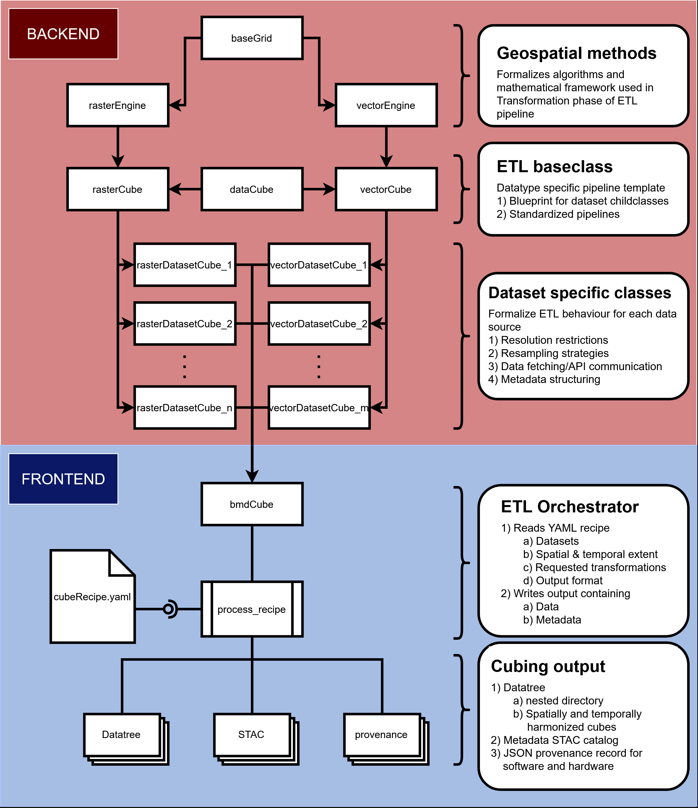

# bmc source code

## Cubing modules

The `bmc` library is structured into different modules depending on the functionality they provide. The main modules within the library that specifically deal with cube generation and harmonization are:

- `engine`: Contains the core geospatial base processing functionality.
- `cube`: Contains the core data cube abstractions and implementations:
  - `spatiotemporal`: Defines the general behavior of raster and vector data cubes.
  - `datasets`: Contains dataset-specific implementations of the blueprints provided in `spatiotemporal`.
  - `bmd`: The orchestrator module containing the main user-facing frontend class.

An overview of the software architecture is provided in the diagram below:

## Data Sources

The `datasource` module contains the functionality used to interface with the different data providers integrated into the cubing engine. Currently, the following data sources are supported:

- `chelsa`
- `gbif`

## Utilities

The `utils` module contains helper functionality utilized across the engine that falls outside the main class hierarchy. Key utilities include:

- `logger`: Formatting functions for pipeline log outputs.
- `provenance`: Automatically captures a system fingerprint of the active execution environment.