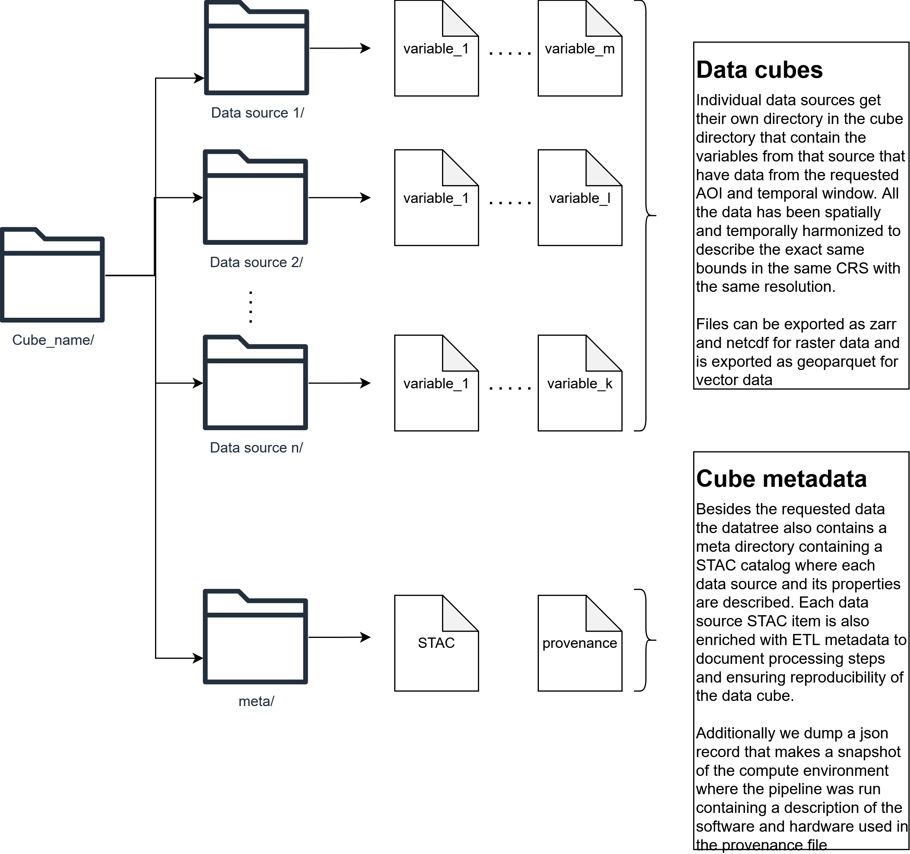
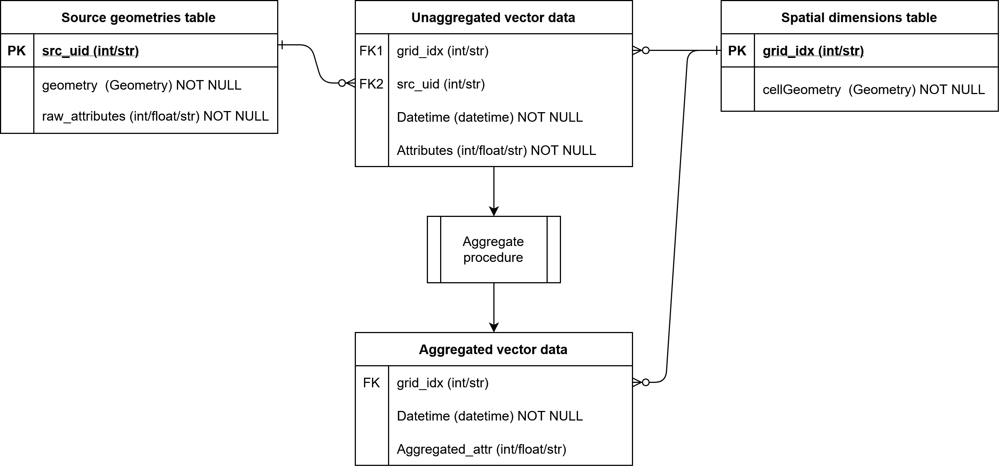

# BMD Cube Orchestrator

The `bmd_cube` class serves as the central orchestrator for constructing multi-dimensional spatiotemporal data cubes. It is designed to manage the end-to-end execution of ecological data pipelines, dynamically dispatching tasks to specific raster and vector engines.

---

## High-Level Overview

By parsing YAML configuration recipes, `bmd_cube` completely automates the generation of unified datasets. It handles asynchronous data fetching, localized dataset warping, and metadata generation, culminating in a highly structured and reproducible output directory. 

**Key Capabilities:**
*   **Dynamic Dispatch:** Automatically routes processing tasks to designated engines like CHELSA (raster) and GBIF (vector) based on YAML configurations.
*   **Asynchronous Execution:** Optimizes pipeline speed by submitting heavy remote API requests (like GBIF) to run in the background while simultaneously downloading and processing synchronous local tasks.
*   **Strict Reproducibility:** Automatically dumps a frozen copy of the executed `recipe.yaml` and generates a rigid `provenance_metadata.json` audit log capturing system environments and execution timestamps.
*   **STAC Integration:** Wraps disparate dataset outputs into cohesive, hierarchically structured PySTAC Catalogs (`catalog.json`) to ensure machine-readable spatial metadata.

---

## Output Directory Structure

The orchestrator generates a highly organized, standardized directory tree upon successful execution. This structure cleanly separates the harmonized ecological datasets from their machine-readable metadata and provenance logs.

### Harmonized Data Cubes
Each processed data source receives its own dedicated subdirectory within the main cube directory. These folders contain the specific variables filtered by the requested Area of Interest (AOI) and temporal window.
* **Strict Alignment:** All data within the cube is spatially and temporally harmonized to describe the exact same bounds, utilizing the same Coordinate Reference System (CRS) and spatial resolution.
* **Optimized Formats:** Raster datasets are exported natively as **Zarr** and **NetCDF**, while vector datasets are exported as **GeoParquet**.

### Cube Metadata & Provenance
Alongside the physical data, a dedicated `meta/` directory is generated to guarantee full auditability and reproducibility of the pipeline.
* **Enriched STAC Catalog:** A SpatioTemporal Asset Catalog (STAC) describes each data source and its spatial properties. Every STAC item is enriched with explicit ETL (Extract, Transform, Load) metadata to document the exact processing steps applied to the source data.
* **Environment Snapshot:** The orchestrator outputs a JSON record (`provenance_metadata.json`) containing a complete snapshot of the compute environment, detailing the exact software and hardware configurations used during execution.

## Vector Cube Output Structure

The `vectorCube` engine standardizes spatial vector datasets into a highly structured relational star schema. This architecture separates the complex physical geometries from the mathematical attribute data, optimizing the data for both spatial visualization and multidimensional analysis.

Below is the Entity-Relationship Diagram mapping the standard output structure:

### 1. Source Geometries Table (Dimension)
This table preserves the original, complex geometries ingested from the raw dataset (e.g., points, multi-polygons) alongside their untouched raw attributes. 
*   **Primary Key (PK):** `src_uid` (Integer or String)
*   **Columns:** `geometry` (WKB Geometry), `raw_attributes`

### 2. Spatial Dimensions Table (Dimension)
Generated during the spatial mapping phase, this table defines the rigid, standard grid topology. It stores the discrete polygons (the "cookie-cutter" cells) that make up the target master grid.
*   **Primary Key (PK):** `grid_idx` (Integer or String)
*   **Columns:** `cellGeometry` (WKB Geometry)

### 3. Unaggregated Vector Data (Base Fact Table)
This acts as the central mapping bridge linking the original source records to the standardized grid. When a source geometry overlaps multiple grid cells, this table captures the fractured relationships and standardizes the temporal data. (Not included standardly in the output but can be included in the recipe explicitly)
*   **Foreign Key 1 (FK1):** `grid_idx` → Links to Spatial Dimensions Table.
*   **Foreign Key 2 (FK2):** `src_uid` → Links to Source Geometries Table.
*   **Columns:** `Datetime` (CF-compliant temporal coordinate), `Attributes` (including spatial weights/fractions).

### 4. Aggregated Vector Data (Summarized Fact Table)
Through the aggregate procedure, the unaggregated mappings are mathematically rolled up into a final multidimensional dataset. Because the spatial mapping and weighting have already been applied, this table drops the `src_uid` and links exclusively to the master grid.
*   **Foreign Key (FK):** `grid_idx` → Links to Spatial Dimensions Table.
*   **Columns:** `Datetime`, `Aggregated_attr` (Summarized mathematical metrics).